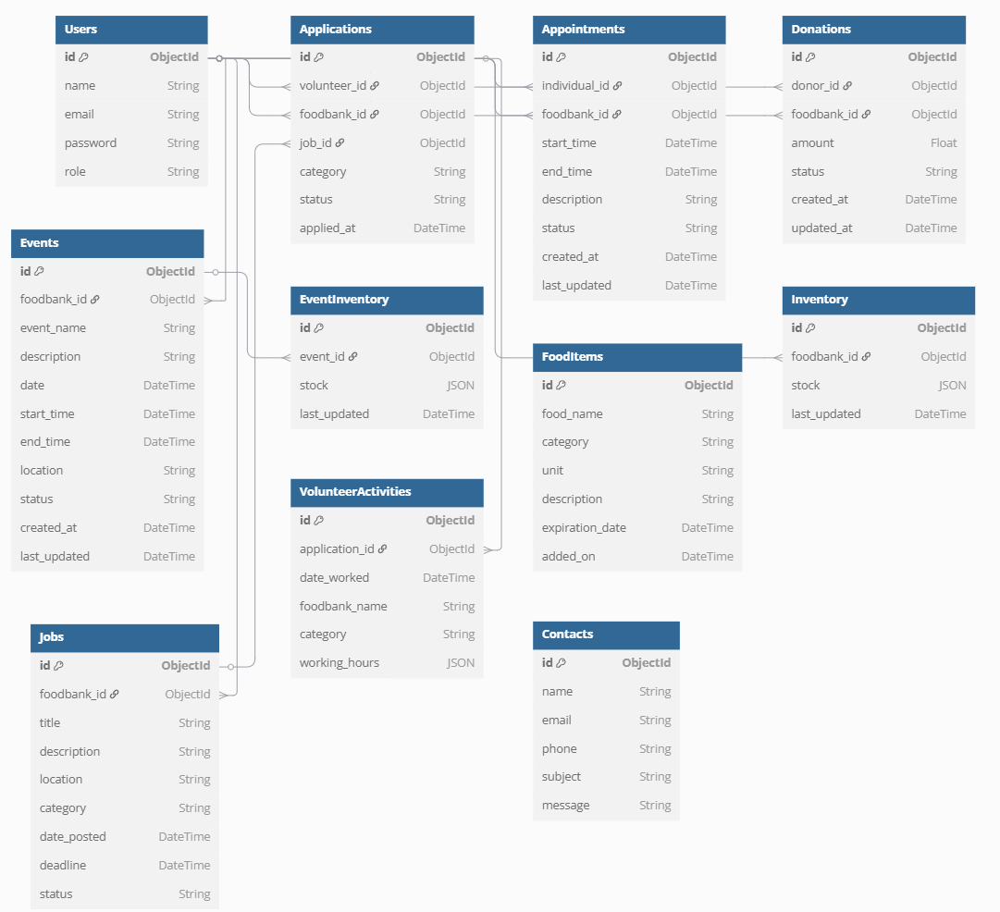

# System Architecture

## Overview
This document provides an overview of the system architecture for the Team-08 PRJ666 Winter 2025 project.

## Components
1. **Frontend**:
   - Built with React.js and Next.js.
   - Deployed on Vercel.
   - Handles user interactions and communicates with the backend via RESTful APIs.

2. **Backend**:
   - Built with FastAPI.
   - Deployed on Render.
   - Provides RESTful API endpoints for authentication, donations, appointments, volunteer applications, and more.
   - Implements business logic and interacts with the database.

3. **Database**:
   - MongoDB for data storage.
   - Stores user data, donations, appointments, events, inventory, and other entities.

## Architecture Diagram

## Data Flow
1. **User Interaction**:
   - Users interact with the frontend through a web browser.
   - The frontend sends API requests to the backend for data retrieval or updates.

2. **Backend Processing**:
   - The backend processes incoming requests, applies business logic, and interacts with the database.
   - Responses are sent back to the frontend in JSON format.

3. **Database Operations**:
   - The backend performs CRUD operations on the MongoDB database.
   - Data is structured into collections such as `users`, `donations`, `appointments`, `events`, and `inventory`.

## Key Features
- **Authentication**:
  - JWT-based authentication for secure access to API endpoints.

- **Role-Based Access Control**:
  - Different roles (e.g., admin, volunteer, donor) have access to specific features and data.

- **Scalability**:
  - The architecture is designed to scale horizontally by adding more instances of the frontend, backend, or database as needed.

- **Error Handling**:
  - Comprehensive error handling and validation at both the frontend and backend levels.

## Technologies Used
- **Frontend**:
  - React.js, Next.js, Tailwind CSS

- **Backend**:
  - FastAPI, Python

- **Database**:
  - MongoDB

- **Deployment**:
  - Vercel (Frontend), Render (Backend)

- **Version Control**:
  - GitHub for source code management and collaboration.